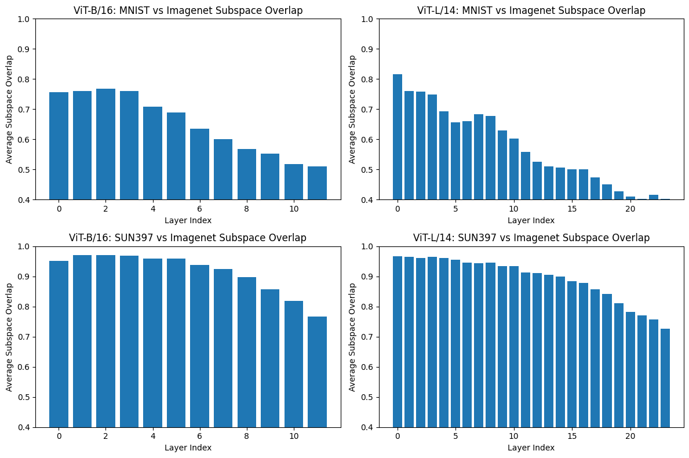

# TAFAL

This repository contains the code for **TAFAL**.  
It is anonymized for double-blind ICML review.

## Environment Setup

### Requirements
- Python 3.10  
- CUDA 12.x (for GPU experiments)  
- NVIDIA driver compatible with the PyTorch CUDA build  

### Create Conda Environment
```bash
conda create -n tafal python=3.10 -y
conda activate tafal
conda install pip -y
```

### Install PyTorch (GPU)
```bash
conda install pytorch torchvision pytorch-cuda=12.1 -c pytorch -c nvidia
```

### Install Dependencies
```bash
pip install -r requirements.txt
```

### Verify Installation
```bash
python -c "import torch; print(torch.cuda.is_available())"
```

### Addition Baselines

| Method | ViT-B/16 Abs | ViT-B/16 Norm | ViT-B/32 Abs | ViT-B/32 Norm | ViT-L/14 Abs | ViT-L/14 Norm | RoBERTa Abs | RoBERTa Norm |
|--------|--------------|---------------|--------------|---------------|--------------|---------------|-------------|--------------|
| Pretrained | 55.48 | 61.64 | 48.14 | 53.75 | 64.93 | 69.73 | 35.51 | 39.38 |
| Task Arithmetic | 73.63 | 81.81 | 70.12 | 78.29 | 80.03 | 85.94 | 58.47 | 70.82 |
| ATLAS | 80.74 | 89.71 | 79.09 | 88.30 | 87.48 | 93.94 | 59.6 | 72.2 |
| TALoS | 79.03 | 87.81 | 77.37 | 86.38 | 85.40 | 91.71 | 63.54 | 76.97 |
| TauJp |  |  | 83.24 | 92.93 |  |  | 62.1 | 75.2 |
| KFAC |  |  | 79.43 | 88.68 |  |  | 59.61 | 72.21 |
| Iso-C | 84.90 | 94.33 | 82.53 | 92.14 | 89.37 | 95.97 | 62.7 | 75.95 |
| Iso-CTS | 85.00 | 94.44 | 82.61 | 92.23 | 89.81 | 96.45 | 61.8 | 74.86 |
| Task Singular Vectors | 85.44 | 94.93 | 83.37 | 93.08 | 88.53 | 95.07 | 67.03 | 81.19 |
| TAFAL (Ours) | 85.39 | 94.88 | 84.03 | 93.81 | 90.69 | 97.39 | 72.52 | 87.85 |

### Task Negation (Retaining 95 percent of the pretrained accuracy)

| Method | ViT-B/16 Tar (↓) | ViT-B/16 Cont (↑) | ViT-B/32 Tar (↓) | ViT-B/32 Cont (↑) | ViT-L/14 Tar (↓) | ViT-L/14 Cont (↑) | RoBERTa Tar (↓) | RoBERTa Cont (↑) |
|--------|------------------|-------------------|------------------|-------------------|------------------|-------------------|------------------|-------------------|
| Pretrained | 55.48 | 68.37 | 48.14 | 63.26 | 64.93 | 75.53 | 57.42 | 65.83 |
| Task Arithmetic | 19.38 | 64.66 | 23.22 | 60.71 | 19.15 | 72.05 | 37.17 | 65.53 |
| ATLAS | 17.34 | 65.84 | 18.76 | 61.21 | 17.75 | 73.28 | 55.44 | 64.42 |
| TALoS | 10.86 | 69.04 | 11.40 | 62.27 | 11.34 | 80.29 | 35.79 | 65.16 |
| TAFAL | 8.70 | 71.26 | 9.07 | 64.09 | 9.83 | 81.97 | 33.30 | 75.17 |
| Tau-J | 13.62 | 62.94 |  |  |  |  |  |  |

## Benchmark: Time & Storage Usage Across Methods For RoBERTa

ATLAS and TaLoS for 5 epochs, Taujp and KFAC for 3 epochs and 10-value hyperparameter search, Task Arithmetic, TSV and Iso-CTS for 10-value hyperparameter search, and TAFAL.

| Method                              | Time (seconds) | Storage (MB) |
|-------------------------------------|---------------:|------------:|
| Task Arithmetic (10-value search)   | 823            | N/A         |
| TAFAL                               | 701            | 4536        |
| ATLAS (5 epochs)                    | 2671           | N/A         |
| TaLoS (5 epochs)                    | 4763           | 3786        |
| TSV                                 | 3998           | 6713        |
| Iso-CTS                             | 3982           | 7351        |
| Taujp                               | 4156           | N/A         |
| KFAC                                | 4262           | 8100        |

### BLIP Addition Results

| Method | OK-VQA Abs | OK-VQA Norm | VQAv2 Abs | VQAv2 Norm | GQA Abs | GQA Norm | COCO Abs | COCO Norm | Flickr30k Abs | Flickr30k Norm |
|--------|------------|-------------|-----------|------------|---------|----------|----------|-----------|----------------|----------------|
| Pretrained | 28.70 | 50.52 | 65.60 | 91.02 | 29.28 | 45.88 | 80.25 | 90.50 | 0.482 | 74.61 |
| ATLAS | 49.50 | 87.14 | 66.00 | 91.63 | 31.29 | 48.62 | 84.88 | 92.16 | 0.532 | 82.60 |
| Task Arithmetic | 47.00 | 82.74 | 62.70 | 88.66 | 27.61 | 43.35 | 75.33 | 84.63 | 0.609 | 94.27 |
| TAFAL (Ours) | 53.20 | 93.66 | 68.10 | 93.24 | 33.54 | 51.83 | 88.59 | 95.79 | 0.628 | 97.21 |
| Iso-C | 49.33 | 86.84 | 63.40 | 89.30 | 30.04 | 46.62 | 63.86 | 72.40 | 0.530 | 82.04 |
| Iso-CTS | 46.66 | 82.14 | 65.10 | 90.69 | 30.67 | 47.41 | 83.92 | 90.99 | 0.600 | 92.87 |
| Task Singular Vectors | 52.80 | 92.95 | 64.80 | 90.58 | 31.92 | 49.06 | 72.84 | 82.19 | 0.580 | 89.78 |

### Lambda Ablation

| **Sun397 & ImageNet** |  |  | **MNIST & ImageNet** |  |  |
|--------------------------------|--|--|----------------------|--|--|
| Lambda | Sun397 (Target) | Imagenet (Control) | Lambda | MNIST | Imagenet |
|--------|-----------------|--------------------|--------|-------|----------|
| 0.1 | 57.35 | 80.23 | 0.1 | 12.97 | 75.54 |
| 0.5 | 56.92 | 79.91 | 0.5 | 12.97 | 75.54 |
| 1 | 54.97 | 78.05 | 1 | 12.97 | 75.54 |
| 5 | 51.01 | 74.69 | 10 | 12.97 | 75.54 |
| 10 | 49.49 | 72.56 | 20 | 12.97 | 75.54 |
| 50 | 47.59 | 69.01 | 50 | 12.97 | 75.54 |
| 100 | 46.93 | 67.96 | 100 | 12.97 | 75.54 |
| 500 | 46.08 | 66.79 |  |  |  |
| 1000 | 45.58 | 65.63 |  |  |  |
| 10,000 | 45.74 | 66.19 |  |  |  |
| 50,000 | 45.8 | 66.3 |  |  |  |

### Layer-wise Subspace Overlap



### Robustness of TAFAL in ViT: Original vs Synthetic Data
Small DCGANs with 5 convolutional(and deconvolutional) layers were trained for 50 epochs to generate the synthetic data.
#### Addition

| Setting | ViT-B/16 | ViT-B/32 | ViT-L/14 |
|--------|----------|----------|----------|
| Synthetic Data | 84.6 | 79.29 | 86.57 |
| Original Data  | 85.39 | 84.03 | 90.69 |

#### Negation

| Setting | ViT-B/16 (Tar) | ViT-B/16 (Cont) | ViT-B/32 (Tar) | ViT-B/32 (Cont) | ViT-L/14 (Tar) | ViT-L/14 (Cont) |
|--------|----------------|-----------------|----------------|-----------------|----------------|-----------------|
| Synthetic Data | 11.635 | 72.9825 | 10.80625 | 64.64125 | 13.46875 | 81.47 |
| Original Data  | 8.7 | 71.26 | 9.07 | 64.09 | 9.83 | 81.97 |

## Notes
- All dependencies are specified in `requirements.txt`.
- This repository will be de-anonymized upon acceptance.
